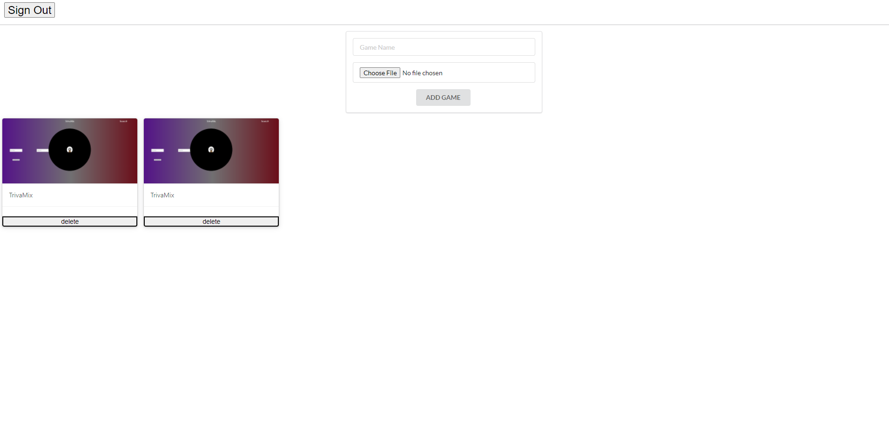

## GameShare

GameShare is an app built to let you keep track of games that you currently own.

#### Get Started
[GameShare](https://melodious-boba-5a1e80.netlify.app/)
[Trello Board](https://trello.com/b/yQI1q60h/capstone-projectgame-finder)

#### Technologies Used

-Express
-JavaScript
-Node.js
-React
-MongoDB

#### Screenshots
Sign Up

Login

Profile

### Next Steps
-Use a game database API
-CSS
-Allow users to share their profiles
-Implement a friends feature
